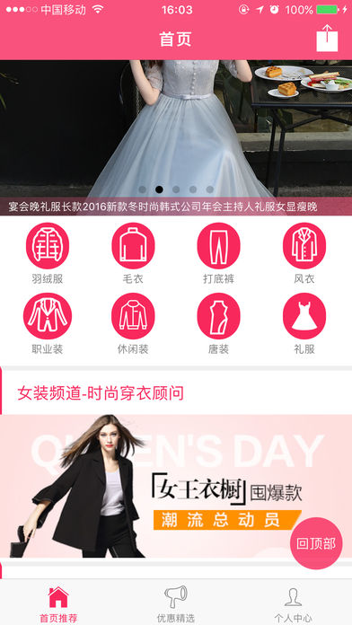
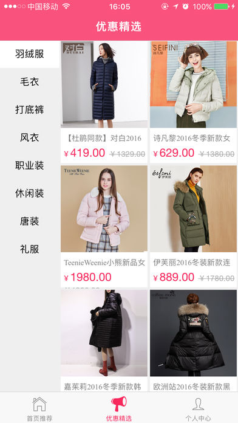

# 关于项目

此项目是基于ionic3+angular4开发的一款导购APP，主要作为教程源码给大家共享。

# 部分截图
   |||||  


# 如何使用

## 安装CLI

```bash
$ npm install -g ionic cordova
```

## 安装node_modules

```bash
$ npm install
```

## 浏览器调试

```bash
$ ionic serve
```

# [Ionic3项目实战教程](http://www.jianshu.com/c/a2bc4a8f2c73)  
ionic3项目实战教程 - 第1讲 ionic3环境安装 项目搭建  
ionic3项目实战教程 - 第2讲 ionic3懒加载配置  
ionic3项目实战教程 - 第3讲 ionic3封装全局网络请求服务app.service  
ionic3项目实战教程 - 第4讲 ionic3商城首页设计(幻灯片+图标分类)  
ionic3项目实战教程 - 第5讲 ionic3商城首页透明导航栏设计  
ionic3项目实战教程 - 第6讲 ionic3 component 组建封装  
ionic3项目实战教程 - 第7讲 ionic3商品列表页的实现  
ionic3项目实战教程 - 第8讲 ionic3商品详情页的实现  
ionic3项目实战教程 - 第9讲 ionic3应用内主题浏览器ThemeableBrowser的使用  
ionic3项目实战教程 - 第10讲 ionic3分类菜单设计(类似外卖)  
ionic3项目实战教程 - 第11讲 ionic3个人中心界面设计    
ionic3项目实战教程 - 第12讲 ionic3制作icon和splash  
ionic3项目实战教程 - 第13讲 ionic3社交分享(QQ分享和微信分享)  
ionic3项目实战教程 - iOS打包上架到应用市场  


# 下载体验

 AppStore:[已上架](https://itunes.apple.com/cn/app/id1194942857)

# 线上预览版

 地址：[预览](http://dress.tongedev.cn)


# 关于我们 
 
QQ群：111055535  
简书ID：[IonicBlog](http://www.jianshu.com/u/7222ddf1ce84)

# 目录结构  

    index.html
    │  service-worker.js
    ├─app
    │      app.component.ts
    │      app.html
    │      app.module.ts
    │      app.scss
    │      app.service.ts
    │      main.ts
    ├─components
    │  │  components.module.ts
    │  │
    │  └─ion-products
    │          ion-products.html
    │          ion-products.scss
    │          ion-products.ts
    │
    ├─pages
    │  ├─about
    │  │      about.html
    │  │      about.module.ts
    │  │      about.scss
    │  │      about.ts
    │  │
    │  ├─contact
    │  │      contact.html
    │  │      contact.module.ts
    │  │      contact.scss
    │  │      contact.ts
    │  │
    │  ├─home
    │  │      home.html
    │  │      home.module.ts
    │  │      home.scss
    │  │      home.ts
    │  │
    │  ├─product-details
    │  │      product-details.html
    │  │      product-details.module.ts
    │  │      product-details.scss
    │  │      product-details.ts
    │  │
    │  ├─product-list
    │  │      product-list.html
    │  │      product-list.module.ts
    │  │      product-list.scss
    │  │      product-list.ts
    │  │
    │  └─tabs
    │          tabs.html
    │          tabs.module.ts
    │          tabs.scss
    │          tabs.ts
    │
    └─theme
            variables.scss

            
# License

本APP代码仅供参考学习，请勿用作商业用途。
